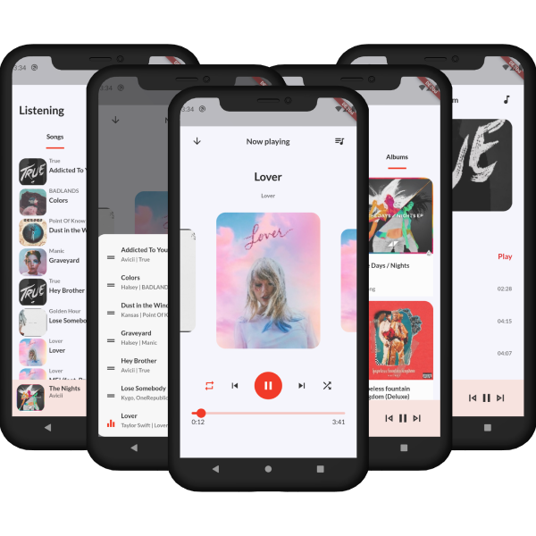

# music_app

A music app build with Flutter, inpired by [this great design](https://dribbble.com/shots/9173692-Music-App)

## Features

- Play, pause, seek local songs
- Run in background
- Shuffle and repeate mode

## Dependencies

- [riverpod](https://pub.dev/packages/flutter_riverpod)
- [on_audio_query](https://pub.dev/packages/on_audio_query)
- [just_audio](https://pub.dev/packages/just_audio)
- [audio service](https://pub.dev/packages/audio_service)

